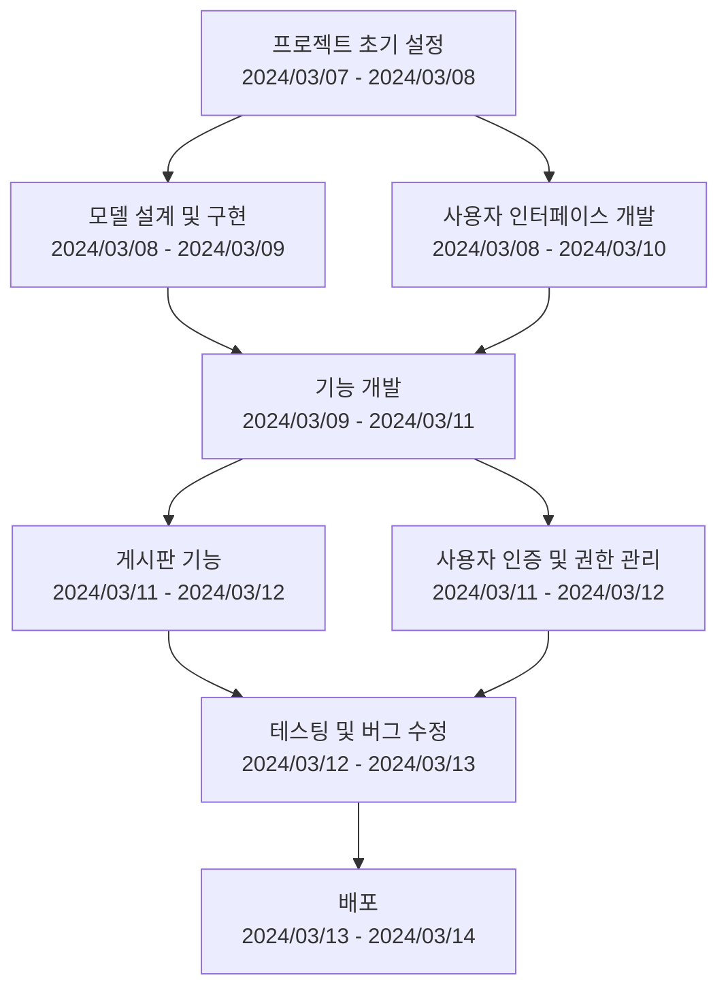

# Django-게시판

## 프로젝트 소개
Django-게시판은 사용자가 자유롭게 게시물을 작성, 조회, 수정, 삭제할 수 있는 웹 애플리케이션입니다. 이 프로젝트는 Django 웹 프레임워크를 기반으로 구현되었으며, 사용자 친화적인 인터페이스를 통해 손쉽게 커뮤니케이션을 할 수 있도록 설계되었습니다.

## 목표
- 사용자가 편리하게 게시물을 관리할 수 있는 웹 사이트 제공
- Django 프레임워크의 기능과 장점을 최대한 활용하여 안정적인 서비스 구현
- 실시간 사용자 상호작용을 통한 동적인 웹 페이지 제공

## 사용 방법
1. 웹사이트에 접속합니다.
2. 회원 가입 후 로그인합니다.
3. 상단 메뉴에서 '게시판'을 선택하여 게시물을 작성하거나 기존 게시물을 조회할 수 있습니다.
4. 게시물 상세 페이지에서는 댓글을 남기거나 게시물을 수정, 삭제할 수 있습니다.

## 기술 스택
- **Backend**: Django, 
- **Frontend**:  CSS, Bootstrap

## WBS

## 사용자 상호작용 흐름
1. 홈페이지 접속
2. 로그인/회원가입
3. 게시판 목록 보기
4. 게시물 작성
5. 게시물 상세 보기/댓글 작성
6. 게시물 수정/삭제

## 의존성 그래프
의존성 그래프는 프로젝트 내의 각 컴포넌트가 어떻게 서로 연결되어 있는지 시각적으로 표현한 것입니다. 이 프로젝트에서 사용된 주요 라이브러리와 프레임워크 간의 의존성을 정리해보세요.

## 시스템 아키텍쳐
시스템 아키텍쳐는 전체 시스템의 구조를 개략적으로 설명하는 다이어그램입니다. 이를 통해 개발자 및 사용자가 시스템의 구성 요소와 그 관계를 이해할 수 있습니다.

## 개발 히스토리
개발 과정에서의 주요 이정표, 결정된 사항, 그리고 변경된 요소들에 대한 간략한 기록입니다.

## 프로젝트 오류 및 해결 과정
개발 과정 중 발생한 주요 문제들과 그 문제들을 어떻게 해결했는지에 대한 설명입니다.

## 개발 동기
이 프로젝트를 시작하게 된 배경, 동기, 그리고 목적에 대한 설명입니다.

## 느꼈던 점
프로젝트를 진행하면서 개인적으로 느낀 점, 배운 점, 도전했던 점 등을 공유하는 공간입니다.

## 개선할 점
프로젝트를 통해 발견한 개선점이나 앞으로 추가하고 싶은 기능 등에 대한 아이디어를 나열합니다.

## 프로젝트를 진행하면서 집중했던 점
프로젝트의 성공적인 완료를 위해 특별히 집중했던 부분들에 대한 설명입니다.
