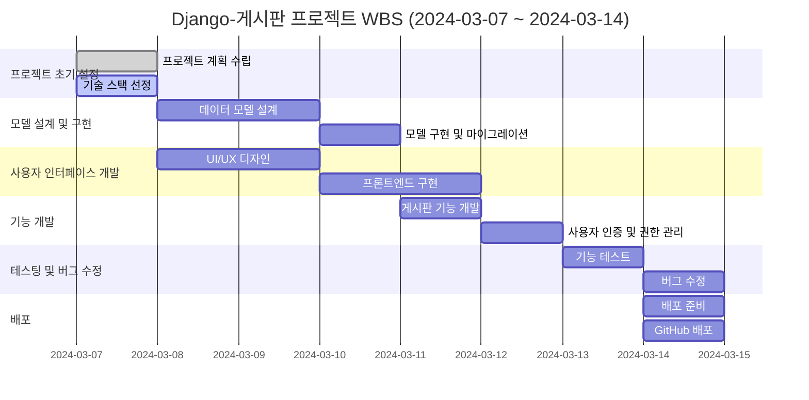
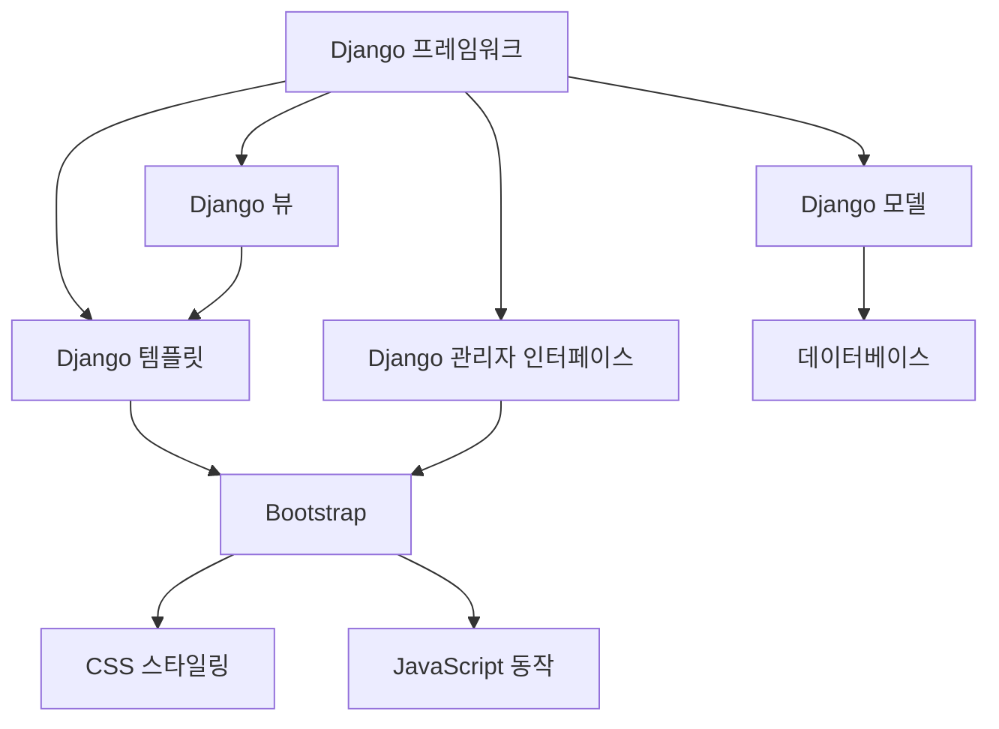

# Django-게시판

## 프로젝트 소개
Django-게시판은 사용자가 자유롭게 게시물을 작성, 조회, 수정, 삭제할 수 있는 웹 애플리케이션입니다. 이 프로젝트는 Django 웹 프레임워크를 기반으로 구현되었으며, 사용자 친화적인 인터페이스를 통해 손쉽게 커뮤니케이션을 할 수 있도록 설계되었습니다.

## 목표
- 사용자가 편리하게 게시물을 관리할 수 있는 웹 사이트 제공
- Django 프레임워크의 기능과 장점을 최대한 활용하여 안정적인 서비스 구현
- 실시간 사용자 상호작용을 통한 동적인 웹 페이지 제공

## 사용 방법
1. 웹사이트에 접속합니다.
2. 회원 가입 후 로그인합니다.
3. 상단 메뉴에서 '게시판'을 선택하여 게시물을 작성하거나 기존 게시물을 조회할 수 있습니다.
4. 게시물 상세 페이지에서는 댓글을 남기거나 게시물을 수정, 삭제할 수 있습니다.

## 기술 스택
- **Backend**: Django, 
- **Frontend**:  CSS, Bootstrap

## WBS


## 사용자 상호작용 흐름
1. 홈페이지 접속
2. 로그인/회원가입
3. 게시판 목록 보기
4. 게시물 작성
5. 게시물 상세 보기/댓글 작성
6. 게시물 수정/삭제

## 의존성 그래프


## 시스템 아키텍쳐
```mermaid
graph TD;
    Client[클라이언트<br>웹 브라우저] -->|HTTP 요청| 웹 서버];
    NGINX -->|정적 자원 요청| Static[정적 파일<br>CSS, JS];
    NGINX -->|동적 요청| Django[Django 애플리케이션 서버];
    Django -->|데이터 처리 요청| DB[(데이터베이스)];
    Django -->|템플릿 렌더링| Templates[템플릿<br>HTML];
    Templates -->|생성된 HTML| Client;
    Static -->|정적 파일 응답| Client;
    DB -->|데이터 응답| Django;
    
  
    Django
    DB
    Static
    
    
    style Client fill:#f9f,stroke:#333,stroke-width:4px
    style Server Side fill:#bbf,stroke:#f66,stroke-width:2px,stroke-dasharray: 5, 5
```


## 개발 히스토리
Django-게시판 프로젝트는 커뮤니티 내 정보 공유의 필요성을 충족시키기 위해 2024년 3월에 시작되었습니다.  이후 기술 스택 선정 과정에서는 Django의 강력한 백엔드 기능과 Bootstrap을 활용한 반응형 프론트엔드 개발에 초점을 맞췄습니다. 초기 프로토타입 개발 후 수정 및 추가하여, 최종적으로  게시판을 완성하였습니다.

## 프로젝트 오류 및 해결 과정
개발 과정에서는 여러 기술적 도전이 있었습니다. 특히, 사용자 인증 시스템 구현에서는 세션 관리 문제가 발생했습니다. 이를 해결하기 위해 Django의 내장 인증 시스템을 사용하여 보안성을 강화했고, JWT(Json Web Tokens)를 도입하여 토큰 기반 인증을 구현했습니다. 또한, 초기에는 모바일 환경에서의 사용성 문제가 있었으나, Bootstrap의 그리드 시스템과 미디어 쿼리를 적극적으로 활용하여 반응형 디자인을 개선하여 문제를 해결했습니다.

## 개발 동기
이 프로젝트의 기획은 디지털 시대에 사람들이 정보를 공유하고 소통하는 방식에 대한 관심에서 시작되었습니다. 또한 Django라는 백엔드 프레임워크를 다뤄보기에 최적화된 프로젝트라 생각하여 시작하게 되었습니다..

## 느꼈던 점

### 장고(Django)의 첫걸음
장고를 처음 접하면서 느낀 점은, 이 프레임워크가 제공하는 강력함과 함께, 그 학습 곡선의 가팔름이었습니다. 모델-뷰-템플릿(MVT) 패턴의 이해부터 ORM(Object-Relational Mapping), 미들웨어, 그리고 인증 시스템에 이르기까지, 장고는 막대한 양의 기능을 내포하고 있었습니다. 그럼에도 불구하고, 장고의 문서화가 잘 되어 있고, 커뮤니티의 지원이 활발하여, 초보자로서도 접근하기 용이했습니다.

### Class-Based Views (CBV)에 대한 인상
장고의 Class-Based Views (CBV) 방식은 처음에는 다소 낯설었습니다. 함수 기반 뷰(Function-Based Views, FBV)에 비해 추상화의 정도가 높고, 재사용성이 더 우수하다는 점에서 큰 장점이 있었습니다. 게시판 프로젝트를 진행하며, CBV의 일관된 패턴을 따르는 것이 유지 보수성과 확장성 측면에서 매우 유리하다는 것을 깨달았습니다. 그러나 CBV를 효과적으로 사용하기 위해서는 장고의 여러 내부 메커니즘에 대한 이해가 필수적이라는 점도 명확해졌습니다.

### 모놀리식 개발 방식에 대한 고찰
모놀리식 아키텍처로 프로젝트를 진행하면서, 모든 컴포넌트가 하나의 코드베이스 안에 통합되어 있다는 점에서 개발과 디버깅이 용이했습니다. 장고는 모놀리식 웹 애플리케이션을 구축하기에 매우 적합한 프레임워크임을 실감했습니다. 특히, 초기 개발 속도와 배포의 단순함이 큰 장점으로 다가왔습니다. 그러나 시스템이 커질수록, 모듈 간의 결합도를 낮추고, 유연성을 확보하기 위한 추가적인 설계 고민이 필요함을 느꼈습니다.

### 종합적인 시각
장고와 함께한 이번 프로젝트는 제 개발 생활에 있어 중요한 이정표가 되었습니다. CBV의 체계적인 접근 방식과 모놀리식 아키텍처의 통합적인 개발 경험은, 향후 다양한 프로젝트와 기술에 대한 접근 방식에 큰 영향을 줄 것입니다. 장고를 처음 배우는 학생 개발자로서 겪은 도전과 성장의 과정은, 앞으로의 개발 여정에 있어 소중한 자산이 될 것입니다.


## 개선할 점
프로젝트를 통해 얻은 경험을 바탕으로, 추후에는 사용자 인터페이스와 상호작용 디자인을 더욱 세심하게 개선할 필요가 있다고 느꼈습니다. 사용자의 작은 불편함도 해소할 수 있는 세심한 기능 추가와 UI 개선이 필요합니다. 또한, 대규모 트래픽에 대비한 서버 최적화와 보안 강화도 지속적으로 이루어져야 할 중요한 과제입니다.

## 프로젝트를 진행하면서 집중했던 점
프로젝트의 성공적인 완료를 위해 가장 중점을 둔 부분은 시스템의 안정성이었습니다. 사용자가 원활하게 정보를 교류하고 소통할 수 있는 인터페이스를 설계하는 데 많은 시간을 할애했습니다. 또한, Django의 강력한 기능을 활용하여 데이터 관리의 안정성과 보안을 최우선으로 고려했습니다. 이를 통해 사용자에게 신뢰받는 서비스를 제공하기 위해 노력했습니다.
